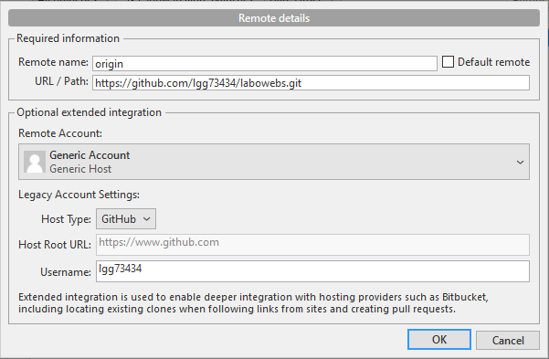
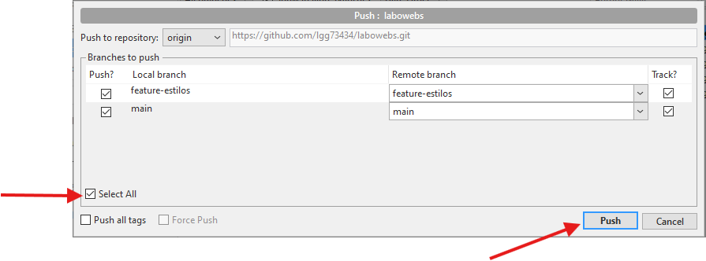
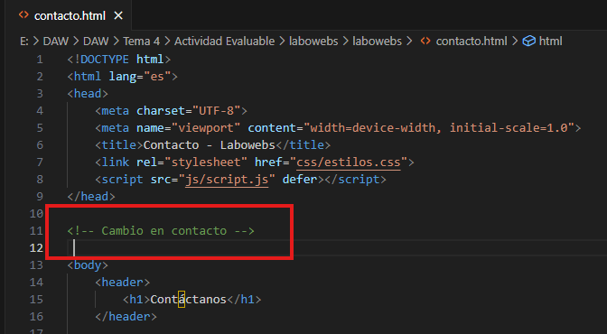
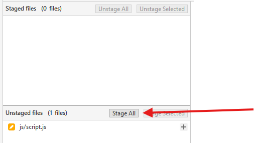
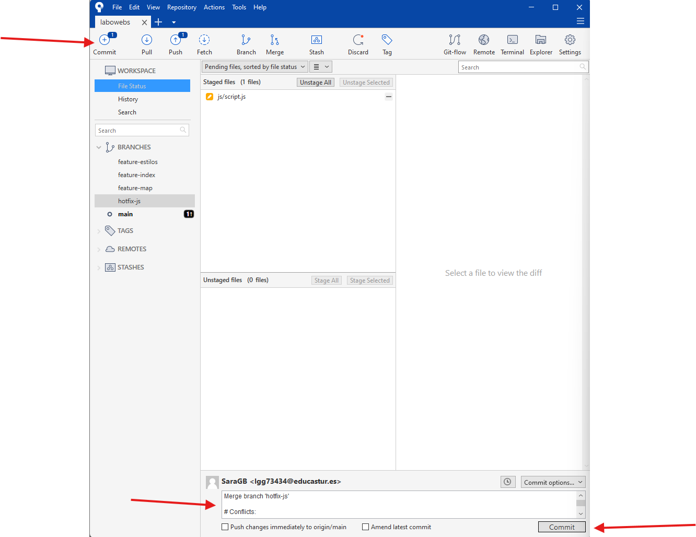

# Ejercicio de Git - Proyecto labowebs

> Sara García Barbas

[TOC]

## Trabajo en local

> Trabajo individual en tu ordenador - Esta parte se resuelve con comandos. 
>
> Tu solución debe incluir el enunciado de cada cuestión, un bloque de código con los comandos GIT utilizados y captura/s de pantalla donde se vea la ejecución de los comandos y su salida.

1. Inicializa un nuevo repositorio Git en una carpeta llamada "`labowebs`" y agrega los archivos proporcionados en el aula virtual. Renombra la rama master a `main` , si es necesario. Realiza el primer commit. Muestra el log del repositorio.

   ```bash
   git init
   git add .
   git commit -m "Repositorio creado"
   git log
   ```

   

   

2. Incluye un fichero `.gitignore` para que los ficheros `README.md` , `LICENCE.txt` y `passwords.txt` sean ignorados por el control de versiones. Realiza el commit y muestra los logs del repositorio en una línea.

   ```bash
   gedit .gitignore
   cat .gitignore
   git add .
   git commit -m "Creado fichero .gitignore"
   ```

   

   

3. En el repositorio, crea los archivos `README.md` , `LICENCE.txt` y `passwords.txt` con algún contenido. Muestra el estado del repositorio. Muestra el listado de archivos ignorados.

   ```bash
   gedit README.md
   cat README.md
   gedit LICENSE.txt
   cat LICENSE.txt
   gedit passwords.txt
   cat passwords.txt
   git status
   git ls-files --others -i --exclude-standard
   ```

   

   

4. Crea una rama `feature-estilos` . Cámbiate a ella. 

   ```bash
   git checkout -b feature-estilos
   ```

   

   - Modifica el archivo `estilos.css` : 

     - propiedad color del `body` y de `h2` : `#5a5a5a` 

       

       

     - propiedad `background-color` de `header` y `footer`: `#2a75cc`

       

     - Comprueba el estado del repositorio. Añade los cambios, realiza un commit con el mensaje  "actualizados estilos a azules"

       ```bash
       git status
       git add .
       git commit -m "Actualizados estilos"
       ```
       
       
       
       
       
       

5. Vuelve a la rama `main` . En el archivo `index.html` añade un comentario donde se indique tu nombre como autor de la página. Comprueba el estado del repositorio. Añade los cambios, realiza un commit con el mensaje ' añadido autor en index'. Muestra los logs del repositorio en una línea, gráficamente y con 'decoración'

   ```bash
   git checkout main
   git status
   git add index.html
   git commit -m "Añadido autor en index"
   git log --oneline --all --decorate
   ```

   

   

6. Fusiona la rama `feature-estilos` en la rama `main`. Muestra los logs del repositorio en una línea, gráficamente y con 'decoración'

   ```bash
   git merge feature-estilos
   git log --oneline --all --decorate
   ```

   

   

<div style="page-break-after: always; break-after: page;"></div>

## Trabajo en remoto

> Esta parte se realizará con la herramienta gráfica `Sourcetree` y con `GitHub`. 
>
> Para cada cuestión, incluye el enunciado y las capturas de pantalla donde se muestre la solución. Si es necesario, incluye alguna explicación

1. Continúa con el repositorio `labowebs`. Añade el repositorio a Sourcetree. 

   

   

2. Crea un repositorio remoto y sube al remoto los ficheros de tu repositorio local. Debes subir todas las ramas. 

   - Clicamos en `Repository / Repository Settings`

   

   

   - En la pestaña de `Remotes` clicamos en el botón `Add`

   

   

   - Rellenamos el campo `Remote name`
   - Rellenamos el campo `URL / Path`
   - Rellenamos el campo `Username`
   - Clicamos en en `OK`

   

   

   - En el menú superior, clicamos en `Push`
   - Seleccionamos el checkbox `Select All`
   - Clicamos en `Push`

   

   

   

   - Los cambios subidos:

   

   

3. Crea una rama `feature-index`. Añade el siguiente código dentro de la `<section class="about">`. Añade los cambios y crea un commit. Sube los cambios al remoto.

   

   

   - En el menú superior clicamos en `Branch`
   - Rellenamos el campo `New Branch`
   - Clicamos en `Create Branch`

   

   

   - Una vez realizados lo cambios en `index.html`, clicamos en `Stage All`

   

   

   - En el menú superior clicamos en `Commit`
   - Añadimos un mensaje al commit
   - Clicamos en `Commit`

   

   

   - En el menú superior, clicamos en `Push`
   - Seleccionamos el checkbox `Select All`
   - Clicamos en `Push`

   

   

4. En el repositorio local, fusiona la rama `feature-index` en la rama `main`. 

   - Nos cambiamos a la rama `main`
   - Hacemos click derecho sobre la rama que queremos fusionar, en este caso `feature-index`
   - Clicamos en la opción `Merge feature-index into current branch`

   

   

5. Edita el fichero `contacto.html`. Muestra los ficheros con cambios pendientes y las diferencias. Añade los cambios y haz un commit. 

   - Hacemos algún cambio desde Visual Studio en `contacto.html` y guardamos.

   

   

   - Vemos como nos aparece el cambio en SourceTree

   

   

   - Clicamos en el botón `Stage All` para añadir los cambios

   

   

   - En el menú superior clicamos en `Commit`
   - Añadimos un mensaje
   - Clicamos en el botón `Commit`

   

   

   - Vemos como nos aparece el commit que acabamos de hacer

   

   

6. Te das cuenta del error. Deshaz el commit anterior. Captura el estado actual del repositorio. 

   - Clicamos con el botón derecho en el commit que queramos revertir
   - En el desplegable seleccionamos la opción `Reverse commit...`

   

   

   - El commit ha sido revertido:

   

   

   - Vemos que en el archivo `contacto.html` ya no aparece la línea añadida anteriormente:

   

   

7. Crea una rama `feature-mapa`. Incluye este código en el archivo `contacto.html`. Añade los cambios. Realiza un commit. Sube los cambios al remoto. Muestra en el remoto los cambios del archivo `contacto.html` en la rama `feature-mapa`.

   

   

   - En el menú superior clicamos en `Branch`
   - Rellenamos el campo `New Branch`
   - Clicamos en `Create Branch`

   

   - Añadimos el código en `contacto.html` y guardamos

   

   

   - Clicamos en el botón `Stage All`

   

   

   - En el menú superior clicamos en `Commit`
   - Añadimos un mensaje
   - Clicamos en el botón `Commit`

   

   

   - En el menú superior clicamos en el botón `Push`

   

   

   - Seleccionamos la rama de la que queramos hacer el push y clicamos en el botón `Push`

   

   

   - En GitHub, clicamos en `Compare & pull request`
   - Y luego en `Create pull request` para que se añadan los cambios desde el repositorio local al repositorio remoto

   

   

   

   - Resultado del push una vez realizados los pasos anteriores

   

   

8. En GitHub, en la rama `main` , fusiona la rama `feature-mapa` . Baja los cambios del remoto a local. Deja los dos repositorios sincronizados.

   - En el menú superior clicamos en `Pull request`
   - Y después en `View pull request`


	

- Por último clicamos en `Merge pull request`
- Podemos añadir un comentario
- Y clicamos en `Confirm merge`


- Resultado del mergeo de las ramas:
- En esta misma pantalla podemos elegir si borrar la rama mergeada o no.


- Para hacer el pull de Sourcetree, clicamos en `Pull`, o en `Repository / Pull...`


- Clicamos en el botón `Pull`


- Ya podemos ver en la interfaz la sincronización con nuestro repositorio remoto:


<div style="page-break-after: always; break-after: page;"></div>


## Conflicto

1. Crea una rama `hotfix-js` . Cámbiate a ella. Añade este código en el fichero `script.js` . Confirma el cambio y haz un commit. (Fíjate en los números de línea...)

   

   

   - En el menú superior clicamos en `Branch`
   - Rellenamos el campo `New Branch`
   - Clicamos en `Create Branch`

   

   

   

   - Hacemos los cambios que nos piden:

   

   

   - Clciamos en el botón `Stage All`

   

   

   - En el menú superior clicamos en `Commit`
   - Añadimos un mensaje
   - Clicamos en el botón `Commit`

   

   

   - Vemos en la interfaz como nos aparece el commit que acabamos de hacer

   

   

2. Vuelve a la rama `main` . En el fichero `script.js` en las mismas líneas que en la cuestión anterior, añade el código siguiente. Confirma el cambio y haz un commit.


- Hacemos doble click sobre la rama a la que nos queremos mover, en este caso `main`


- Realizamos los cambios solicitados en el fichero:


- Clicamos en el botón `Stage All`


- En el menú superior clicamos en `Commit`
- Añadimos un mensaje
- Clicamos en el botón `Commit`


- Ya nos aparece en la interfaz el commit que acabamos de realizar


3. Fusiona la rama `hotfix-js` en `main` . Debe producirse un conflicto. Resuélvelo. Cuando termines la resolución del conflicto sube los cambios al remoto - Deja los repositorios sincronizados - 

   > Esta parte se realizará con la herramienta gráfica Sourcetree y con GitHub . Para cada cuestión, incluye el enunciado y las capturas de pantalla donde se muestre la solución. Si es necesario, incluye alguna explicación
   
   - Nos cambiamos a la rama `main`
   - Hacemos click derecho sobre la rama que queremos fusionar, en este caso `hotfix-js`
   - En el desplegable, seleccionamos la opción `Merge hotfix-js into current branch`	


- Nos sale un aviso que nos indica que tenemos un conflicto sin resolver


- Para solucionar el conflicto, abrimos el fichero en Visual Studio Code:
  - El propio Visual nos dará distintas opciones para solucionar el conflicto. En este caso he decido pulsar en `Aceptar cambio entrante`


- Se aplica en el archivo la solución que hayamos elegido


- Volvemos a SourceTree y realizamos de nuevo el commit:




- Vemos que ahora la fusión de las ramas si se ha llevado a cabo


- Realizamos el Push para subir los cambios al repositorio remoto


- Ya podemos ver en GitHub los cambios subidos desde nuestro repositorio local


<div style="page-break-after: always; break-after: page;"></div>

## Subida de documentación

En la carpeta del proyecto `labowebs` añade una carpeta `docs` . Copia en esa carpeta el fichero markdown y la carpeta con las imágenes. Incluye también el `pdf` . Añade todo al repositorio. Súbelo al remoto.

Este apartado se puede realizar en SourceTree o con comandos.


Ahora repetimos los pasos para realizar el Stage All, después realizariamos un commit y por último un push para subirlo todo a nuestro repositorio remoto.
